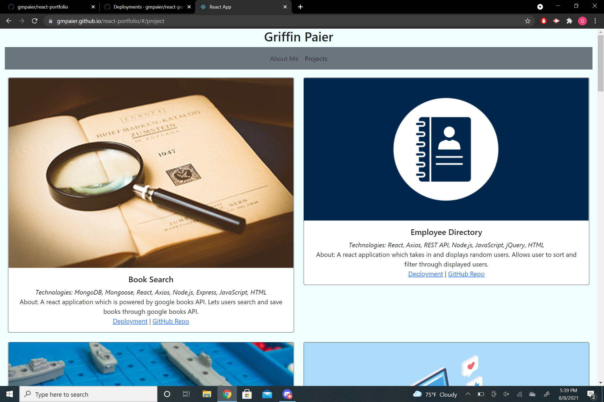

# react-portfolio

## Table of Contents

[Description](#description) 

[Installation](#installation) 

[Site Overview](#site-overview) 
 
[Questions](#questions)

## Description

An online portfolio to display the various web development projects I've made. This application is a remake of an earlier portfolio application I created, now using React.

## Installation

[Portfolio Deployment](https://gmpaier.github.io/react-portfolio/#/)

There is no need to install this application, simply follow the deployed link above.

## Site Overview

This site is divided into two main pages. The "About" page has general information about myself, my education, and my hobbies. It also includes a list of technologies I'm proficient in, as well as various means of contacting me. The "Project" page houses links to the various projects I've completed, mainly throughout the course of my UConn web design bootcamp. Each project card has a short description of the project, a list of the main technologies used, a deployed link for applications with a front-end, and a link to the associated Github repository.

## Questions
Any questions regarding this application can be directed to [Griffin Paier](mailto:gmpaier@loyola.edu). 
